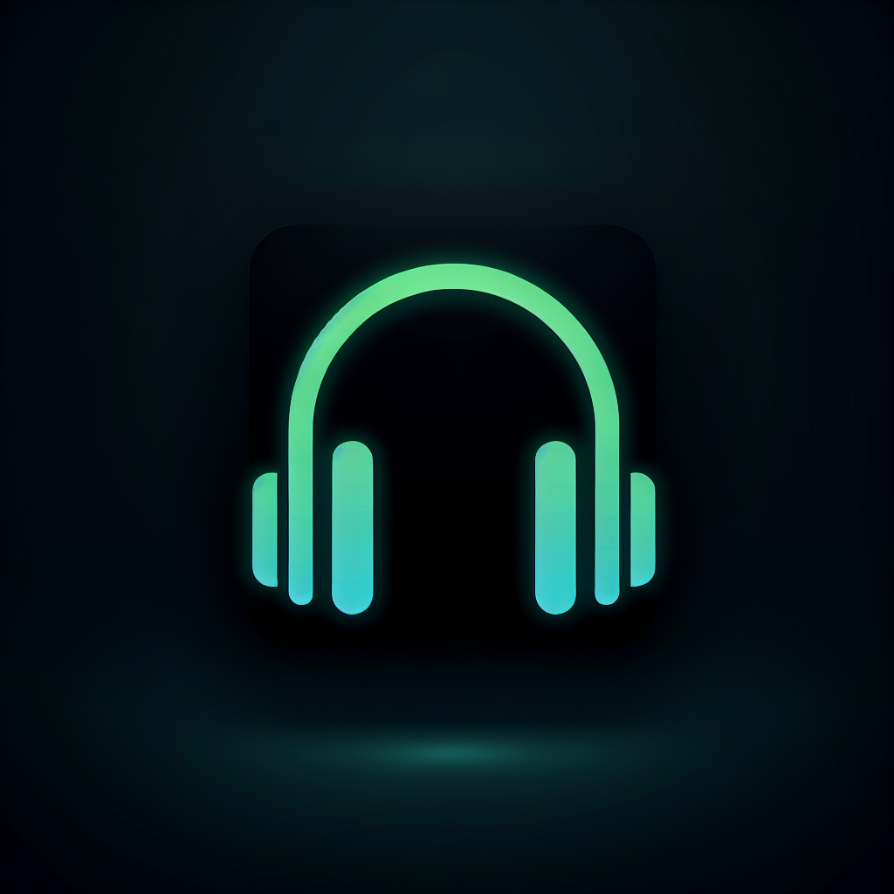

# VoiceCanvas

VoiceCanvas is a powerful text-to-speech platform built with Streamlit that transforms text into expressive voice content with AI-powered tools.

## Features

- **Text-to-Speech Conversion**: Convert any text to speech using ElevenLabs API
- **Voice Cloning**: Clone voices for personalized audio content
- **Voice Dubbing**: Dub audio/video with new voices
- **Character Voice Mapping**: Assign different voices to dialogue characters
- **AI-Powered Tone Analysis**: Analyze emotional tone and musical characteristics
- **Advanced Smart Features**: Mood-based playlists, social listening rooms, and more
- **Customizable API Settings**: Use built-in APIs or your own keys

## Dependencies

- Streamlit
- Groq
- Pandas
- Pydub
- Requests

## Setup & Installation

1. Clone this repository
2. Rename `requirements_for_deployment.txt` to `requirements.txt`
3. Install the required packages: `pip install -r requirements.txt`
4. Set up your API keys (ElevenLabs, Groq) as environment variables or use the in-app settings
5. Run the application: `streamlit run app.py`

## API Keys

The application requires the following API keys:
- ELEVENLABS_API_KEY - For text-to-speech and voice cloning
- GROQ_API_KEY - For AI text analysis and dialogue generation
- Optional: OPENAI_API_KEY - For additional AI capabilities

## Deployment

The app can be deployed on Streamlit Cloud:
1. Push the code to GitHub
2. Connect Streamlit Cloud to your GitHub repository
3. Add the API keys as secrets in the Streamlit Cloud dashboard
4. Deploy the app

## License

MIT

## Credits

- Build with Streamlit
- UI inspired by Spotify
- Voice generation powered by ElevenLabs
- AI text analysis powered by Groq
